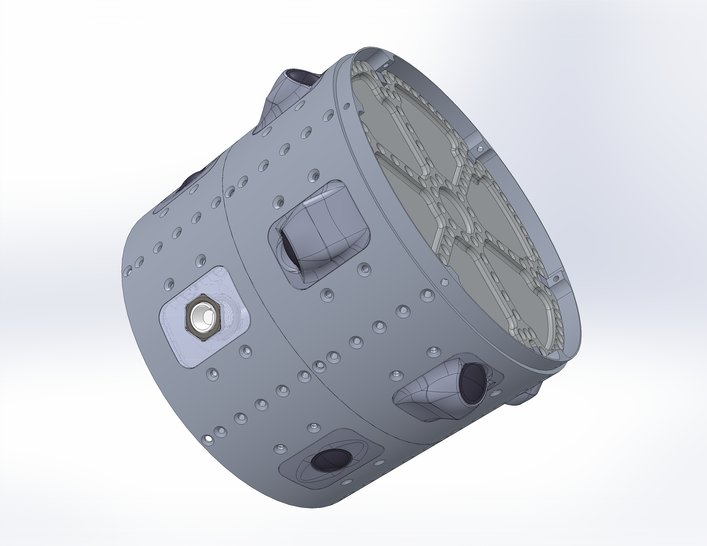

# Structure for the Camera Ring

## Ring
[Drawing](structure/passthroughRing.pdf)  
This ring holds the RunCams for LV3. 
It can also be used as an umbilical ring or a passthrough for any payloads that need access to the airstream.
Such payloads can mount to the ring via the screw holes surrounding the windows.

## Bulkhead
[Drawing](structure/bulkhead.pdf)  
The inner hub, spokes, and outer rim are each rated to 150 pounds force. (FS=1.3)
Although this totals to 450 pounds force, no more than 150 should ever be applied to a single region.
(Can asymmetric loads push the FS below 1.3 while following these rules?)
The expected points of failure are the screw holes in the inner hub and the bracket mounting holes.

Holes may be cut in the webbing between the ribs and in the middle of the inner hub, without significantly affecting the strength of the bulkhead.
If you have access to the SolidWorks SimulationXpress extension though, this is easy to check.

This is intended for use in the camera module, but can be used in any module.

### Bulkhead Bracket
[Drawing](structure/bulkheadBracket.PDF)  
This bracket can be machined on any manual mill.
It attaches the bulkhead to the inside of the ring.
Every hole gets a 4-40 helicoil.

### Camera Master Controller Board
[Drawing](fireHazard/cameraMasterBoard.PDF)  
This holds the pixie-wrangling devices that turn the cameras on simultaneously and power said cameras.
It also probably powers other things on the rocket, at least on L-13.

### Battery Box
[Part](fireHazard/batteryBox.SLDPRT)  
This holds the battery that powers the cameras. 
It's intended to be FDM printed out of PLA.
You can probably get away with a relatively low infill (30%?), as long as you use a decent wall thiccness (1 to 2 mm).
